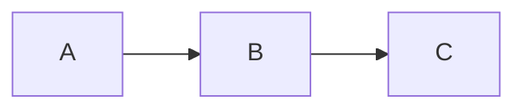
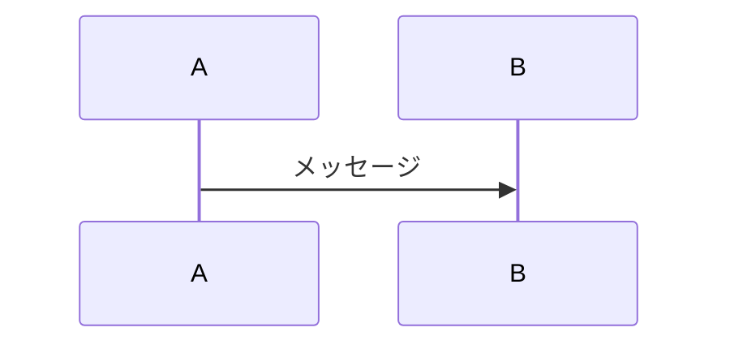

# Zenn Markdown記法ガイド

このファイルは、Zennで使用できるMarkdown記法の一覧です。
参照元: https://zenn.dev/zenn/articles/markdown-guide

---

## 標準Markdown記法

### 見出し

```markdown
# 見出し1
## 見出し2
### 見出し3
#### 見出し4
```

**注意**: アクセシビリティの観点から、見出し2（`##`）から始めることを推奨。

---

### リスト

```markdown
- リスト1
- リスト2
  - ネストされたリスト

1. 番号付きリスト1
2. 番号付きリスト2
```

---

### リンク

```markdown
[リンクテキスト](https://example.com)
```

エディタではテキスト選択後にURLをペーストで自動リンク化。

---

### 画像

```markdown


  # 幅指定
```

---

### テーブル

```markdown
| 見出し1 | 見出し2 |
| ------- | ------- |
| セル1   | セル2   |
```

---

### コードブロック

````markdown
```言語名
コード
```

```言語名:ファイル名
コード
```
````

---

### 数式（KaTeX対応）

```markdown
$$
数式ブロック
$$

インライン数式は $e^{i\pi} + 1 = 0$ のように記述
```

---

## Zenn独自記法

### メッセージ

```markdown
:::message
メッセージをここに
:::

:::message alert
警告メッセージ
:::
```

**表示例**：
- `:::message` → 情報メッセージ（青）
- `:::message alert` → 警告メッセージ（黄）

---

### アコーディオン（折りたたみ）

```markdown
:::details タイトル
折りたたまれる内容
:::
```

---

### ネスト化

4つのコロン `::::` で外側を囲むと、メッセージやアコーディオンをネストできます。

```markdown
::::message
外側のメッセージ

:::details 詳細を見る
内側のアコーディオン
:::
::::
```

---

## 埋め込み機能

### 自動埋め込み（URLのみの行）

以下のサービスは、URLのみの行で自動的に埋め込まれます：

- リンクカード（一般的なURL）
- X（Twitter）ポスト
- YouTube
- GitHub（リポジトリ、Issue、Pull Request）
- GitHub Gist

```markdown
https://github.com/username/repo
```

---

### 明示的な埋め込み

```markdown
@[youtube](動画ID)
@[codepen](埋め込みURL)
@[jsfiddle](埋め込みURL)
@[codesandbox](埋め込みID)
@[stackblitz](埋め込みID)
@[figma](ファイルID)
```

---

## ダイアグラム（mermaid.js）

````markdown



````

対応しているダイアグラム：
- フローチャート（`graph`）
- シーケンス図（`sequenceDiagram`）
- クラス図（`classDiagram`）
- 状態遷移図（`stateDiagram`）
- ER図（`erDiagram`）
- ガントチャート（`gantt`）
- など

---

## よく使う組み合わせ

### コードブロック + ファイル名

````markdown
```typescript:src/index.ts
const message: string = "Hello, Zenn!";
console.log(message);
```
````

### アコーディオン + コードブロック

````markdown
:::details 実装の詳細
```typescript
// コード
```
:::
````

### メッセージ + リスト

```markdown
:::message
注意点：
- ポイント1
- ポイント2
:::
```

---

## 参考リンク

- 公式Markdownガイド: https://zenn.dev/zenn/articles/markdown-guide
- mermaid.jsドキュメント: https://mermaid-js.github.io/mermaid/
