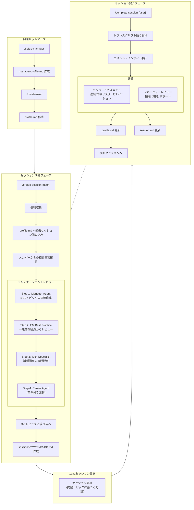

## はじめに

「1on1、ちゃんとできているのか分からない」

エンジニアリングマネージャー（EM）なら一度はこう感じたことがあるのではないでしょうか。

1on1は二者間で行われ、会話内容には個人情報やセンシティブな話題が含まれます。そのため、上司や人事を含む第三者に共有することが難しく、**品質を客観的にレビュー・改善する仕組みが存在しない現場が多いのではないでしょうか**。

この課題を解決するために、Claude Codeを活用した「1on1サポートエージェント」のテンプレートを公開しました。

**テンプレートはこちら**: https://github.com/lil-ikeda/1on1-agent

## 対象読者

このテンプレートは**Claude Codeを使えるエンジニアリングマネージャー**向けです。

- Claude Codeのセットアップと基本操作ができる方
- ターミナル操作に抵抗がない方
- 1on1の品質改善に関心があるEM

※Claude Codeの利用が必須です。

## こんな課題を感じていませんか？

- 1on1の準備に毎回時間がかかる
- 前回何を話したか覚えていない
- メンバーの状態変化に気づけているか不安
- 自分の1on1の進め方が正しいのか分からない
- 退職やモチベーション低下の兆候を見逃していないか心配

これらは多くのEMが抱える共通の悩みです。しかし、1on1の内容を第三者に見せられない以上、外部からのフィードバックを得ることは困難でした。

## 1on1-agentでできること

このテンプレートは、以下の機能を提供します。

### 1. 1on1準備支援
過去のログを分析し、次回の1on1で話すべきアジェンダを提案します。前回の宿題や継続的に追うべきトピックを自動でピックアップし、準備時間を大幅に短縮できます。

### 2. 1on1ログ分析
蓄積されたログから傾向やインサイトを抽出します。「最近キャリアの話題が増えている」「業務負荷に関する言及が多い」など、見落としがちなパターンを可視化します。

### 3. メンバー情報管理
メンバーごとの情報を構造化して保持します。キャリア志向、強み・弱み、過去の相談内容などを整理し、1on1の質を高めます。

### 4. マネージャーの1on1品質レビュー
**これが最大の差別化ポイントです。** AIがあなたの1on1の進め方をレビューし、改善点をフィードバックします。傾聴できているか、適切な質問ができているか、アクションにつながっているかなどを客観的に評価します。

### 5. リスク・モチベーションのスコア化
退職リスク、休職リスク、モチベーションを定量化します。主観に頼りがちな「なんとなく元気がない」という感覚を、過去のデータに基づいて可視化できます。

## なぜClaude Codeなのか

### Claude Codeを選んだ理由

私が普段からClaude Codeを使っていたことに加え、複数のエージェントを管理できるので、多角的な視点からレビューをしてもらいたいという要件に合致していたからです。

このテンプレートでは、1つのコマンド実行で複数のエージェントが順番にレビューを行います（ワークフロー図の「マルチエージェントレビュー」参照）。一般的なEMの観点、職種固有の専門観点、キャリア観点など、多角的な視点からのフィードバックを一度に得られます。

Codexなど他のCLIを使っている方は、フォークして同様のルールを追加すれば動くと思います。ツールによって精度や効果に差があるかは検証できていないので、時間がある時に比較してみたいとは思っています。

### 個人情報の取り扱いについて

:::message alert
**個人情報の取り扱いに関する重要な注意事項**

1on1のログには、メンバーの個人情報、健康状態、キャリア志向、人間関係の悩みなど、極めてセンシティブな情報が含まれます。

利用にあたっては、**所属組織の情報セキュリティポリシーを必ず確認**してください。必要に応じてメンバーへの事前説明・同意取得についてもご検討ください。
:::

## 必要な環境

- **Claude Code**: このテンプレートはClaude Codeのエージェント機能を前提としています
- Claude Codeのサブスクリプション（Max、Pro、またはTeam）
- ターミナル環境

## 使い方

1. GitHubからテンプレートをクローン
2. Claude Codeでリポジトリを開く
3. 1on1ログを所定のフォーマットで保存
4. エージェントを実行して分析・提案を取得

詳細なセットアップ手順は、リポジトリのREADMEをご確認ください。

### ワークフロー概要



### 出力例：セッションドキュメント

実際に生成されるセッションドキュメントの例を紹介します。

**1on1前（準備フェーズ）**

```markdown
## Preparation (AI Generated & Reviewed)

### Topic 1: 技術選定の相談（gRPC vs REST）

**Suggested Questions**:
- 「比較検討してみて、どんな観点で迷っていますか？」
- 「チームの他のメンバーはこの選定についてどう思っていそうですか？」
- 「運用面での懸念点はありますか？」

**Background**:
前回からの持ち越し事項。田中さんが自分で整理してくる予定だったので、
まずは本人の考えを聞く。テックリードを目指す上で、技術選定の判断力を
伸ばす良い機会。

### Topic 2: メンタリング負荷の調整

**Suggested Questions**:
- 「今のメンタリングで特に時間がかかっている部分はどこですか？」
- 「佐藤さんの成長度合いをどう感じていますか？」
- 「理想的なメンタリングの頻度や形はどんなイメージですか？」

**Background**:
残業増加（週10時間）の一因として本人が認識。メンタリングは成長機会と
捉えている一方、自分の開発時間とのバランスに悩んでいる。他のメンバーとの
分担や、頻度の見直しを一緒に検討する。

### Topic 3: ...（以下省略）
```

**1on1後（評価フェーズ）**

```markdown
## Member Assessment Score (AI Generated)

| Metric | Score | Change | Rationale |
|--------|-------|--------|-----------|
| Turnover Risk | 2/5 | → | 現在の役割に高い満足度。技術的挑戦ができる環境を楽しんでいる |
| Burnout Risk | 2/5 | ↑ | 「このペースが続くと...」という発言あり。残業とメンタリング負荷の継続監視が必要 |
| Motivation | 4/5 | → | プロジェクトへの意欲は高い。技術選定プロセスを楽しんでいる様子 |

### Alerts
- バーンアウトリスクが前回から微増。「このペースが続くと...」という発言を
  見逃さないこと。次回セッションで残業状況を必ず確認する。

## Manager Review (AI Generated)

### Overall Rating: ★★★★☆ (4/5)

| Aspect | Rating | Comment |
|--------|--------|---------|
| Active Listening | ★★★★☆ | メンバーに十分な発言機会を与えた |
| Quality of Questions | ★★★★☆ | 技術選定の理由について良い深掘りができた |
| Follow-up | ★★★★★ | 前回からの持ち越し事項をすべてカバー |
| Support Provided | ★★★★☆ | メンタリング負荷に対する具体的な解決策を提示 |
| Topic Selection | ★★★★☆ | メンバーのリクエストを適切に中心に据えた |

### Areas for Improvement
- 「このペースが続くと...」という発言をもっと深掘りすべきだった
  - **改善案**: 「どのくらいのペースなら持続可能だと思いますか？」と聞く
```

このように、1on1前には話すべきトピックと質問例を提案し、1on1後にはメンバーの状態評価とマネージャー自身へのフィードバックが生成されます。

## 実際に使ってみて

自分で使ってみて感じたことを書いておきます。

### 準備がめちゃくちゃ楽になった

正直、1on1の準備って地味に時間かかりませんか？前回何話したっけ、今回は何を確認すべきだっけ、と考えているうちに15〜30分経っていることがよくありました。

このテンプレートを使い始めてからは、コマンド1つで過去のログから話すべきトピックをピックアップしてくれます。その内容をチェック・レビューする時間を含めても5分程度で済むようになりました。

### 「これでいいのか」という不安が減った

私はEMになってまだ1年ちょっとです。1on1のやり方なんて誰にも習ったことがないし、自分のやり方が正しいのかどうか、確かめる術がありませんでした。

メンバーの時間をもらっている以上、価値のある時間にしたいという思いはあるものの、「本当に価値があるのか？」は分からないまま。このモヤモヤがずっとありました。

AIにレビューしてもらえるようになって、このモヤモヤがだいぶ減りました。「なんとなくの雑談になっていないか」「メンバーが発したネガティブなシグナルを見逃していないか」といった観点でフィードバックがもらえるのは、思っていた以上に安心感があります。

### 試行錯誤と留意点

**要約を入力すると精度が落ちる**

最初はGoogle Meetが生成する要約を入力していました。しかし、メンバー本人の自覚よりも過度に休職リスクが高く判定されてしまうケースがありました。要約の過程でネガティブなニュアンスが強調されてしまうのかもしれません。

生の文字起こしをそのまま貼り付けることで、本人の自覚により近い判定が出るようになりました。

**スコアリングロジックのチューニングが必要**

現状のスコアリングロジックはClaude Codeに生成させたものです。会社の文化やメンバーの特性によっては、そのままでは適切に機能しないかもしれません。使いながらプロンプトを調整していく前提で考えてください。

**初回セットアップには手間がかかる**

メンバーごとにプロフィールを作成する初回セットアップは、正直それなりに手間がかかります。ただ、メンバーの特性や情報を整理する作業自体は、どんな手法をとるにせよやった方がいいプロセスだと思っています。一度作ってしまえば、あとは1on1ごとに自動更新されていきます。

## AIレビューの信頼性について

一応書いておくと、AIのレビューを手放しに信頼するのはおすすめしません。

あくまで補助として使うのが良いと思っています。可能であれば、AIの分析結果についてメンバーに「なんか違和感ある？」と聞いてみるのもいいかもしれません。そのフィードバックを元にプロンプトをチューニングしていけば、精度は上がっていくはずです。

### AIが見ている評価基準

参考までに、このエージェントがどのような基準でレビューしているかを簡単に紹介します。

**メンバー評価（3指標）**

| 指標 | 高リスクのサイン例 |
|------|------------------|
| 離職リスク | キャリア目標と現業務のギャップ、「他社では」という発言 |
| バーンアウトリスク | 慢性的な疲労、「限界」「消耗」という言葉 |
| モチベーション | 「まあ」「一応」「とりあえず」という曖昧な表現の増加 |

**マネージャー評価（5観点）**

| 観点 | チェックポイント |
|------|-----------------|
| 傾聴の質 | メンバーの発言時間は十分か？遮っていないか？ |
| 質問力 | オープンな質問をしているか？「なぜ」で深掘りしているか？ |
| フォローアップ | 前回の宿題を確認したか？継続トピックを追跡しているか？ |
| サポート・行動 | ブロッカーを解消したか？具体的な支援を提案したか？ |
| トピック設計 | 事前準備はあるか？メンバーにとって意味ある話題か？ |

AIは「まあ」「一応」といった言葉のニュアンスや、「実は」「正直なところ」という本音が出てきているサインを分析しています。そのため、**要約ではなく生のトランスクリプト**を入力することで精度が上がるのではないかと予想されます。

## 発展的な活用アイデア

まだ妄想段階ですが、こんな使い方もできるんじゃないかと思っています。

### セルフコーチングエージェント

マネージャー向けじゃなくて、メンバー個人が使えるセルフコーチングエージェントがあってもいいなと。自分のキャリアや業務について、AIと壁打ちできる仕組みです。

### 仮想メンター

社内メンバー全員がプロフィールを登録しておけば、普段話す機会がない人との仮想的な面談ができるかもしれません。例えば会社の代表とか、他部門のシニアメンバーとか。通常は1on1の機会がない相手との対話をシミュレートできたら面白そうです。

## まとめ

1on1は二者間のプライベートな場であるからこそ、品質改善が難しい領域でした。Claude Codeを活用することで、**客観的なフィードバックを得る**という、これまで難しかったことが実現できます。

EMとしての成長、メンバーとの関係性向上に、ぜひこのテンプレートを活用してください。

---

**GitHub**: https://github.com/lil-ikeda/1on1-agent

テンプレートの改善提案やバグ報告は、GitHubのIssueからお願いします。

質問やフィードバックがあれば、コメント欄でお気軽にどうぞ。
