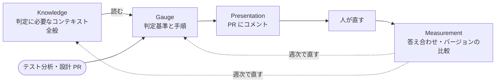
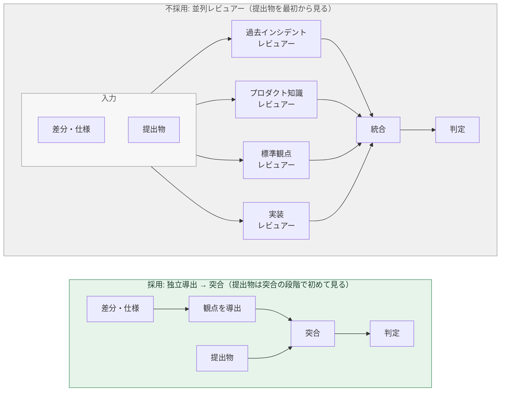

テストケース群が「十分か」を判定する仕組みを作っています。社内では QA Gauge と呼んでいます。テストケースを生成する AI ではなく、提出されたテストケース群に過不足がないかを判定する AI です。

まだ「委譲できた」とは言えない段階なので、この記事はその実況の 1 本目になります。一言でいうと、**QA の「判断」を LLM に委譲できるか。判定器そのものより先に、判定結果を評価する仕組みを作っている**、という話です。

## なぜ作ろうと思ったか

きっかけは、QA の関与が局所的になっていることでした。

QA チームが見られるのは依頼された案件だけで、本当は全案件に関与したい。ですが QA メンバーより開発メンバーのほうが多い体制で、人間が全部をチェックするのはリソース的に不可能です。

しかも案件ごとに関与すると、理解が「点」になります。その案件の変更箇所を調べて観点を出し、テストして、次の案件へ進む。調査で分かった依存関係は案件の外に届かず、どこにも貯まりません。

過去の本番インシデントを分類してみると、約 4 割は「修正箇所ではない部分が壊れる」デグレ型でした。該当機能の設計書や資料を読むだけでは検知できないものです。点の理解を続ける限り、この 4 割は残り続けます。

だから、テストケースを書く「作業」ではなく、それで足りるかという「判断」を AI に委譲する仕組みが要ると考えました。ただし任せるには、任せて大丈夫だと言える根拠が要ります。

## まだ判断は委譲できていない

先に正直に書いておくと、現状は人間のレビューに追加で回している段階で、人間の判断は減っていません。この記事は「できた」ではなく「ここまで来た」の記録です。

## 基本コンセプト

**生成ではなく判定。** テストケースの生成は既に AI がやっています。委譲するのはレビューの工程、つまり提出されたテストケース群に過不足がないかの判定で、何を重要とみなすかの定義は QA が保守し続けます。

**評価できれば改善できる。** 最適な判定器を一度で作り切るのは現実的ではないと思ったので、判定結果を評価する仕組みを先に作りました。

**指標は品質とスピードの 2 軸。** 品質は本番インシデント数、スピードはリリースのリードタイムです。片方だけを追うと、何も通らない装置か、無いのと同じ装置になります。

ただし本番インシデント数では改善が回りません。四半期でしか読めず、月に数件しか起きず、増やすこともできないからです。そこで中間指標として、**人間レビューの前後差分を一旦の正解にする**ことにしました。レビューで足された行・消された行は毎日出ますし、正解を作る手間がありません。人間のレビューを通ったのにインシデントになるリスクは、この段階では許容します。

この正解に対して QA Gauge の指摘がどれだけ当たっていたかを、次の 2 つの的中率で測り、改善の中間指標にしています。

- Gap Hit Rate = 人間が足した行のうち、先に「足りない」と言えていた割合（品質側）
- Surplus Hit Rate = 人間が消した行のうち、先に「余計」と言えていた割合（スピード側）

2 つは合算しません。合算すると、観点を多く出すバージョンが Gap 側の点数だけで良く見えてしまうためです。

役割は 4 つに分けています。Gauge（判定基準と手順）、Knowledge（ドメインの基本的な知識、過去のインシデント、依存関係など、十分性を判断するために必要なコンテキスト全般）、Measurement（答え合わせとバージョンの比較）、Presentation（PR での見せ方）です。日次で判定してコメントし、週次で答え合わせをして Gauge か Knowledge を直します。

## 運用方法

15 分に 1 回 GitHub の PR を巡回し、テスト分析・設計の PR に判定結果を自動コメントします。採用するかどうかは PR 作成者に任せていますが、**不採用の理由は返信してもらいます**。それが Gauge を直す材料になります。

バージョンは 2 つ持っています。判定基準と手順（Gauge）のバージョンを Engine version、判定が参照する知識（Knowledge）のバージョンを Knowledge version と呼び、判定結果には両方を記録して掛け合わせで管理しています。判定が変わったとき、基準と知識のどちらが動いたかを後から追えるようにするためです。

バージョンを上げるときは、A/A テストと A/B テストを必ず行います。A/A テストは同じバージョンで同じ入力を複数回実行し、判定のブレの幅を取るものです。A/B テストは新旧バージョンで同じ入力を実行して結果を比べるもので、ブレの幅より小さい差は「変わらない」とみなします。A/B テストでベースラインを割ったら、そのバージョンは上げません。判定器そのものの安定性を常時測る仕組みは、初期バージョンでは作りませんでした。早くフィードバックループに載せることを優先し、このルールで代替しています。

## ここまでの成果と失敗

自動コメントは送信できていて、返信も集まり始めています。

| 返信の区分 | 割合 |
|---|---:|
| 対応する | 約 3 割 |
| 一部対応 | 約 1 割 |
| 対応しない | 約 6 割 |

不採用の理由は 4 種類に分かれました。「変更の影響範囲外で、その経路は無い」が約 40%、「unit テストや CI、実機で既に担保している」が約 35%、「再現手段が無い」が約 17%、「プロダクト判断や該当データ不在」が約 9% です。

方式の比較で、1 つ捨てたものがあります。「観点を独立に導出してから提出物と突き合わせる」方式と、「複数のレビュアーエージェントが提出物に直接コメントする」方式です。

後者は判定時間が半分以下に縮んで速かったのですが、提出物に引っ張られる傾向があり、人間が後から足した行を先に言えた割合が明確に下がりました。速さより漏れの検知を取りました。

判定器に提出物を先に見せてはいけない、という教訓が得られました。

## 今後

Knowledge の整備を優先的に進めていきます。Knowledge は、QA Gauge 以外にもこれまで通りのテスト分析や、問い合わせ対応、障害調査など様々な用途に使用することもできるはずですし。

特に impact-map、つまり「何を変えると何が壊れるか」の充実を優先します。影響範囲の特定精度を上げないと、冒頭の 4 割のデグレ型インシデントは防げません。

## さいごに

全てのアウトプットを人間がチェックできれば理想ですが、チェックしている間に事業がスピードで負けては本末転倒です。当たり前のことですが、QA もビジネスで勝つために存在していることを忘れてはいけません。

スピードを上げるには、LLM に判断を委譲する方法を真剣に考えていかなければなりません。そのためには、LLM の出力を QA が評価できるようになっていかないといけないと思っています。AI を挟んで作られる生成物がほとんどになるので、この比重は増えていくでしょう。

QA Gauge はその最初の一歩です。引き続き進捗があれば経過報告していこうと思います。
