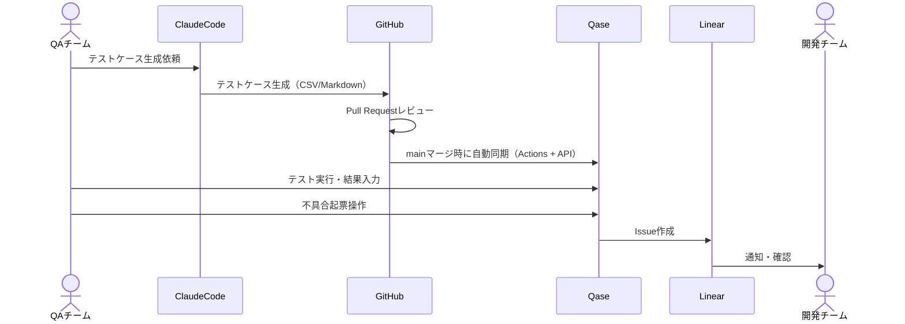

## はじめに

「気になるAIツールがあるけどQAの業務に組み込めていない」もしくは「ツールを使い始めてみたもののテスト設計に必要な工数がいまいち減っている感じがしない」...AI Agent時代のテスト設計において、こうした課題を抱えている方は多いのではないでしょうか。

QAチームのEngineering Managerとして、2025年3月にチームを立ち上げてから約8ヶ月が経ちました。立ち上げ当初から、テストマネジメントツールの必要性は感じていたものの、目の前のテスト設計・実行業務に追われ、またルールや業務フローの整備を日々進めていたり、メンバー構成が変化していたりする中で、ツールに求める要件が確定できず、選定を半年ほど保留していました。

その間、テストケースはCSVファイルで管理していました。主要なテストマネジメントツール（TestRail、BrowserStackなど）は基本的にCSVインポート機能を持っているため、どのツールを選んでも移行可能な状態を保っておきたかったからです。

そして2025年10月、ようやくQaseを選定しました。本記事では、**「Agenticなテスト設計を支えるテストマネジメントツールかどうか」**という観点でツールを評価し、Qaseを選定するに至った経緯を紹介します。

@[card](https://qase.io/)

## 本記事の前提

:::message
ClaudeCodeを活用したテスト設計については、以前の記事で紹介しましたが、この取り組みを前提としたツール選定となっています。
:::

https://zenn.dev/toridori/articles/5b4ff343a60855

## 従来のテストマネジメントツール選定基準

一般的なテストマネジメントツール（TestRail、Zephyrなど）は、テストケースの作成から実行結果の管理まで、すべてをツールのWebUI上で完結させる設計になっています。

従来の選定基準では、以下のような点が重視されてきたかと思います：

- **WebUIの使いやすさ**: テストケース作成画面の直感性、入力のしやすさ
- **テストケース管理機能**: フォルダ構造、タグ付け、検索機能
- **レポート機能**: ダッシュボード、進捗可視化、カバレッジ計測
- **実行管理**: テストランの作成、結果記録、履歴管理
- **外部連携**: Jira、Slackなど既存ツールとの統合

これらは今でも重要な要素ですが、AI Agentを活用したテスト設計が前提になると、**ツールに求める役割が大きく変わってきます**。

## AI Agent時代に変わったこと

私たちのチームでは、2025年夏からClaudeCodeを活用したテスト設計を導入しました。この取り組みを通じて、テストマネジメントツールに求める役割が大きく変化しました。

### テストケース作成の自動化

ClaudeCodeは、仕様書やデザインファイルから、テスト観点やテストケース（確認手順と期待値）を自動生成できます。生成されたテストケースはMarkdown/CSV形式でGitHubリポジトリに保存され、Pull Requestでレビューされます。

この変化により、**テストマネジメントツールのWebUIでテストケースを1件ずつ手動入力する必要がなくなりました**。

### 仕様書のGitHub管理

プロダクトの仕様書は2025年春頃からGitHubリポジトリで管理する取り組みを始めていました。ClaudeCodeが効果的にテストケースを生成するには、こうした仕様書などのコンテキストにアクセスできる必要があるため、この取り組みが基盤となりました。

これにより、以下が実現できました：

- **コード・仕様・テストケースの三位一体管理**: すべてGitHub上で管理
- **AI agentがアクセスしやすい**: ClaudeCodeがリポジトリ内のすべての情報を参照可能
- **AIも人間も読みやすい**: Markdown形式で統一

### ツールの役割の変化

これらの変化により、テストマネジメントツールに求める役割が以下のように変わりました：

| フェーズ | Before（従来） | After（AI Agent時代） |
|---------|---------------|---------------------|
| **テストケース作成** | ツールのWebUIで手動入力 | ClaudeCodeが自動生成 → GitHubで管理 |
| **バージョン管理** | ツール内の履歴機能 | GitのPull Request / マージ をトリガーに自動同期 |
| **レビュー** | ツール内コメント or Slack | GitHubのPull Requestレビュー |
| **実行結果入力** | ツールのWebUI | **ツールのWebUI（変わらず重要）** |
| **レポート・分析** | ツールのダッシュボード | **ツールのダッシュボード（変わらず重要）** |

つまり、**テストケースの作成・管理はGitHub中心に、実行結果の管理とレポーティングはツール中心に**という役割分担になりました。

## 新しい選定基準：「Agenticなテスト設計」を支える3つの要件

前セクションで説明したように、テストマネジメントツールの役割が変化したことで、選定基準も変わってきました。私たちが重視した要件は以下の3つです。

### 1. AI Agentとの親和性

ClaudeCodeがテストケースを生成し、それをツールに同期するワークフローを実現するには、**API経由でのテストケース操作が不可欠**です。

具体的には以下の機能が必要でした：

- **テストケース作成・更新API**: GitHub上のCSV/Markdownファイルから、APIでテストケースを作成・更新できること
- **SharedStep（共通手順）管理API**: テストデータの準備手順など、複数のテストケースで共通する手順をテンプレート化し、API経由で管理できること

:::details SharedStepの具体例とメンテナンス性について

**具体例: ログイン済み状態のSharedStep**
```
1. テストユーザーでログインページにアクセス
2. メールアドレス: test@example.com を入力
3. パスワード: ********** を入力
4. ログインボタンをクリック
5. ダッシュボード画面が表示されることを確認
```

このSharedStepは、例えば以下のような複数のテストケースで再利用されます：
- プロフィール編集のテストケース
- 設定変更のテストケース
- データエクスポートのテストケース

**メンテナンス性の向上**

SharedStepとしてテストケースとは別で管理しておくことで、手順の一部に変更があった時の修正範囲を限定的にできます。例えば、上記のログイン手順に変更があった場合、SharedStepを1箇所修正するだけで、それを参照しているすべてのテストケースに変更が反映されます。もしSharedStepがなければ、ログイン手順を含むテストケースを全て個別に更新していく必要があり、非常に手間がかかります。

:::

ClaudeCodeが将来的にテストケースマネジメントに関連する指示も実行できるよう、APIが充実していることを重視しました。

### 2. 既存開発ツールとの統合

テストマネジメントツールは、既存の開発ツールとシームレスに統合できる必要がありました。

#### Linear連携

もともとエンジニアのタスク管理にLinearを使用していたため、不具合起票もLinearに統一したかったという背景があります。テスト実行中に発見した不具合を、ツールから直接LinearのIssueとして起票できることは必須要件としました。Linear Issue作成ができないツールは、この時点で候補から除外しました。

#### GitHubワークフロー統合

エンジニアと同じワークフローでテストケースを管理したかったため、以下が必要でした：

- GitHubのPull Requestでテストケースをレビュー（**エンジニアにレビューしてもらうことも多いため**）
- mainブランチへのマージをトリガーに、GitHub Actionsで自動的にツールへ同期

これにより、**コード・仕様・テストケースをGitHub上で一元管理**できます。ツール側に専用のコンテキストを構築する必要がなく、AIも人間も同じ情報源を参照できる状態が作れます。

### 3. 実運用のしやすさ

テストケースの作成はClaudeCodeに任せられますが、**テスト実行と結果入力は人間が行う**ため、WebUIの使いやすさは依然として重要です。

具体的には以下を重視しました：

- **実行結果入力のWebUI**: 直感的で入力しやすいインターフェース
- **テスト実行フェーズの体験**: 1つのテストケースが1画面で完結する、環境ごとの実行結果を記録できる、など
- **ダッシュボードの充実**: テスト進捗や不具合率を可視化し、結果を分析するためのダッシュボード機能

## 候補ツールの比較

ADRで比較したツールのうち、主要な項目を抜粋して比較します。

### 比較表

| ツール | Linear連携 | テストケース<br/>作成API | テストケース<br/>更新API | SharedStep<br/>API | ダッシュボード | 料金（月額） | 総評 |
|--------|:----------:|:------------------------:|:------------------------:|:------------------:|:--------------:|:------------:|------|
| **Qase** | ⭕ | ⭕ | ⭕ | ⭕ | ⭕ | $24/user<br/>（Read Only: $4） | **最有力候補** |
| **BrowserStack** | ⭕ | ⭕ | ⭕ | ❌ | ⭕ | $199/10人 | SharedStep API なし |
| **TestRail** | ❌ | ⭕ | ⭕ | ❌ | ⭕ | $38/user | Linear連携なし、UI古い |
| **QA Sphere** | ⭕ | ❌ | ⭕ | ❌ | ⭕ | $12/user | テストケース作成APIなし |
| **X-Ray** | - | - | - | - | - | - | Jiraプラグイン（対象外） |
| **Zephyr** | - | - | - | - | - | - | Jiraプラグイン（対象外） |

※各ツールには複数の料金プランが存在しますが、上記は弊社が検討していたプランの金額を記載しています

### 詳細比較：候補の4ツール

#### 🔹 TestRail

老舗のテストマネジメントツールで、安定性と実績があります。

**良かった点**：
- テストケース作成・更新APIは提供されている
- ダッシュボード機能は充実

**除外理由**：
- **Linear連携がない**（最重要要件を満たさず）
- SharedStep管理APIがない
- UIが古く、実際に触ってみた感じ動作も遅かった
- 価格も比較的高め（$38/user/month）

#### 🔹 BrowserStack

実行環境提供サービスとして有名ですが、テスト管理機能も持っています。

**良かった点**：
- Linear連携あり
- テストケース作成・更新APIあり
- ダッシュボード機能あり
- 10人で$199/monthと比較的リーズナブル

**惜しかった点**：
- **SharedStep（共通手順）操作のためのAPIがない**
- テストデータをSharedStepsで管理する想定だったため、API経由で操作できないのは痛い
- 実行環境提供機能は現時点では不要（将来的には有用かもしれない）

#### 🔹 QA Sphere

価格が$12/user/monthと非常にリーズナブルなツールです。

**良かった点**：
- Linear連携あり
- テストケース更新APIあり
- ダッシュボード機能あり
- 価格が安い

**除外理由**：
- **テストケース作成APIがない**（更新APIのみ提供）
- ClaudeCodeで生成したテストケースを新規作成できないため、GitHub Actionsからの自動同期ワークフローが実現できない
- 手動でテストケースを作成してからAPIで更新する運用になってしまう

#### 🔹 Qase（選定）

**選定理由**：
- **3つの要件をすべて満たした唯一のツール**
- Linear連携あり
- テストケース作成・更新API、SharedStep管理APIともに充実
- GitHubワークフローとの統合が容易
- ダッシュボード機能も充実
- Read Only Userを安価（$4/user/month）に招待できるため、エンジニアにも共有しやすい

**最終的な決め手**：
最終候補としてBrowserStackとQaseの2つが残りましたが、以下の2点でQaseを選定しました：

1. **SharedStep APIの有無**: テストデータ準備の手順をテンプレート化し、API経由で管理できることは、ClaudeCodeとの連携を考えると重要な要件でした
2. **料金体系の柔軟性**: Read Only Userを$4/user/monthで招待できるため、エンジニアなど多くのメンバーに閲覧権限を付与しやすい

## Qaseを選んだ理由

前セクションで比較した通り、Qaseは3つの要件をすべて満たした唯一のツールでした。ここでは、Qaseを選定したことで実現できるワークフローについて説明します。

### 実現したいワークフロー

Qaseを選定したことで、以下のワークフローが実現できます：



このワークフローにより、以下が実現できます：

1. **テストケース作成の自動化**: ClaudeCodeが仕様書から自動生成
2. **エンジニアレビューの組み込み**: GitHubのPull Requestで、コードレビューと同様のプロセスでテストケースをレビュー
3. **自動同期**: mainブランチへのマージをトリガーに、GitHub ActionsがQase APIを呼び出してテストケースを同期
4. **シームレスな不具合管理**: Qaseでの不具合発見時、Qaseから直接LinearのIssueを作成し、開発チームに通知

### Linear連携による不具合管理の効率化

もともとエンジニアのタスク管理にLinearを使用していたため、不具合起票もLinearに統一することで、以下の効果が期待できます：

- **一元管理**: 開発タスクも不具合も同じツールで管理
- **スムーズな連携**: 開発チームが普段使っているツールで不具合を確認・対応できる
- **トレーサビリティ**: テストケースと不具合、不具合と修正コードの紐付けが明確になる

### API充実度の重要性

SharedStep管理APIがあることで、テストデータ準備の手順を以下のように管理できます：

1. ClaudeCodeがテストデータ準備手順をSharedStepとして生成
2. GitHub ActionsがQase APIでSharedStepを作成・更新
3. テストケースからSharedStepを参照

これにより、共通手順の変更が必要になった際も、GitHubで管理しているMarkdownファイルを更新するだけで、Qase側にも自動的に反映されます。

## まとめ・今後の展望

### AI Agent時代のテストマネジメントツールに求められるもの

本記事では、ClaudeCodeを活用したテスト設計を前提に、テストマネジメントツールを選定した経緯を紹介しました。

AI Agentの進化スピードは非常に速く、特定のAIツールに依存した設計は避けるべきだと考えています。一方で、テストケースを手書きする時代は終了しつつあり、**AI Agentで生成したテストケースをいかに効率よく開発オペレーションに組み込むか**という観点でのツール選定が重要になります。

そのために今回重視したのは：

1. **API充実度**: AI agentが生成したテストケースを、ツールに同期できること。特定のAIツールに依存せず、どのAI agentからでもAPI経由でアクセスできる設計
2. **既存開発ワークフローとの統合**: GitHubでのレビュー、Linearでの不具合管理など、エンジニアが慣れ親しんだワークフローにテストケースを自然に組み込める
3. **実運用のしやすさ**: AI agentはテストケース作成を担当し、人間はテスト実行と結果分析に集中できる役割分担

これらの要件を満たすQaseを選定したことで、**AI agentによるテストケース生成と、既存の開発プロセスをシームレスに統合**できるワークフローが実現できます。

### 今後の課題

現時点ではまだ運用を本格的に開始していないため、今後以下の点を検証していく必要があります：

- **実際の運用開始後の効果測定**: ClaudeCodeとQaseの連携により、テスト設計・実行の工数がどの程度削減できるか
- **さらなる自動化の可能性**: テスト実行結果のAI分析や、不具合の自動トリアージなど
- **ワークフローの最適化**: GitHub Actionsでの同期タイミングや、エンジニアレビューのプロセスを改善

### おわりに

AI Agentの活用が進む中、テストマネジメントツールに求められる要件も変化しています。本記事が、同様の課題を抱えている方の参考になれば幸いです。

なお、今回の選定ではコストは優先順位が低く、機能要件を重視しました。Qaseの料金体系（$24/user/month、Read Only Userは$4/user/month）は、チーム規模に対して妥当と判断しています。

ご質問やフィードバックがありましたら、ぜひコメントでお聞かせください。
